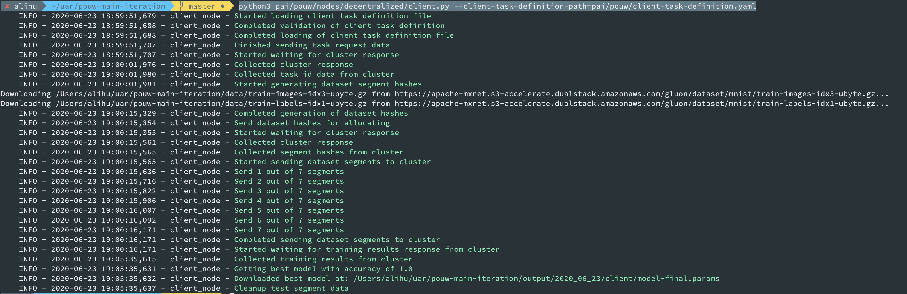

## How to run PoUW locally on your computer
#### in 10 simple steps

This setup assumes you will be running a local PAICoin node and three ML miners (on the same machine).
This should be used for testing and debugging purposes.

### MacOS via Homebrew

1. Let's clone the PAICoin PoUW branch and the ML trainer extension by running the following commands:
    ~~~~
    git clone -b "pouw-q4" --single-branch https://github.com/projectpai/paicoin.git
    
    git clone https://github.com/projectpai/pouw-main-iteration
    ~~~~

2. Install the prerequisites to build the PAICoin code and to run the ML trainer extension:
    ~~~
    brew install automake berkeley-db4 libtool boost miniupnpc pkg-config python qt libevent qrencode zmq
    
    brew install python3 grpc
    ~~~

3. Create a directory `~/Application\ Support/PAIcoin/` where we will add two configuration files:
```
mkdir ~/Library/Application\ Support/PAIcoin/
cd ~/Library/Application\ Support/PAIcoin/
```
4. We'll place here a file called` paicoin.conf` that has the following content:
    ~~~
    server=1
    bantime=1
    daemon=0
    rpcuser=paicoin
    rpcpassword=10050021
    rpcport=4002
    testnet=1
    rpcallowip=0.0.0.0/0
    txindex=1
    onlynet=ipv4
    listenonion=0
    maxtipage=31104000
    listen=1
    rpcbind=0.0.0.0
    verificationserver=0.0.0.0:50011
    printtoconsole=1
    connect=0
    ignore-not-connected=1
    dnsseed=0
    ~~~

5. We'll add another file called `chainparams.conf` with this content:
```
GENESIS_BLOCK_TIME = 5
GENESIS_BLOCK_REWARD = 1470000000
INITIAL_BLOCK_REWARD = 150
BLOCK_TIME = 5

TESTNET_CONSENSUS_POW_LIMIT = 01ffffffffffffffffffffffffffffffffffffffffffffffffffffffffffffff
TESTNET_GENESIS_BLOCK_POW_BITS = 20
TESTNET_GENESIS_BLOCK_NBITS = 0x2001ffff
TESTNET_GENESIS_BLOCK_SIGNATURE = 9a8abac6c3d97d37d627e6ebcaf68be72275168b
TESTNET_GENESIS_BLOCK_UNIX_TIMESTAMP = 1546300800

TESTNET_PUBKEY_ADDRESS = 51
TESTNET_SCRIPT_ADDRESS = 180
TESTNET_SECRET_KEY = 226

TESTNET_MAGIC_BYTE_0 = 11
TESTNET_MAGIC_BYTE_1 = 9
TESTNET_MAGIC_BYTE_2 = 17
TESTNET_MAGIC_BYTE_3 = 7

TESTNET_PORT = 18567
TESTNET_RPC_PORT = 18566

TESTNET_SEED_0 =
TESTNET_SEED_1 =
TESTNET_SEED_2 =
```

6. Now we'll switch back to where we cloned the two repositories and we'll build the the PAIcoin blockchain part by running:
    ~~~~
    cd paicoin/

    ./autogen.sh

    ./configure --with-gui=no --disable-tests --disable-bench --enable-chainparams-conf

    make -j $(sysctl -n hw.physicalcpu) 
    ~~~~

7. We'll create the genesis block.
    ~~~~
    cd src/

    ./paicoind -mine-genesis-block
    ~~~~

8. Now, we switch to the Python code and install the ML trainer:
    ~~~~
    cd ../../pouw-main-iteration/

    python3 setup.py develop
    ~~~~

9. Now, it's already time to run the system.
* Start the verification server, so we type:
    ~~~~
    python3 pai/pouw/verification/server.py
    ~~~~

* In another terminal, we start the *paicoind* process, therefore from the original directory where we initially cloned the repos, we run this:
    ~~~~
    cd paicoin/src/

    ./paicoind -ignore-not-connected
    ~~~~

* We start another terminal in the initial clone directory and we'll start the ML training cluster with 3 nodes:
    ~~~~
    cd pouw-main-iteration/

    python3 pai/pouw/start_cluster.py --nodes-number 3
    ~~~~
    

* From another terminal we run the client that starts the training process. The output should be similar to this window during the whole process:
    ~~~~
    cd pouw-main-iteration/

    python3 pai/pouw/nodes/decentralized/client.py --client-task-definition-path=pai/pouw/client-task-definition.yaml
    ~~~~
    
* In the blockchain window, when blocks are added we can see an output like this:

    
10. Let's check the results:
* You can open a new Terminal and check with `paicoin-cli` the blockchain status:
    ```
    cd paicoin/src/

    ./paicoin-cli --rpcuser=paicoin --rpcpassword=10050021 --rpcport=4002 getmininginfo
    ```
    
* While the mining and training is taking place, you can see the verifications in the output window of `server.py`:
    .

